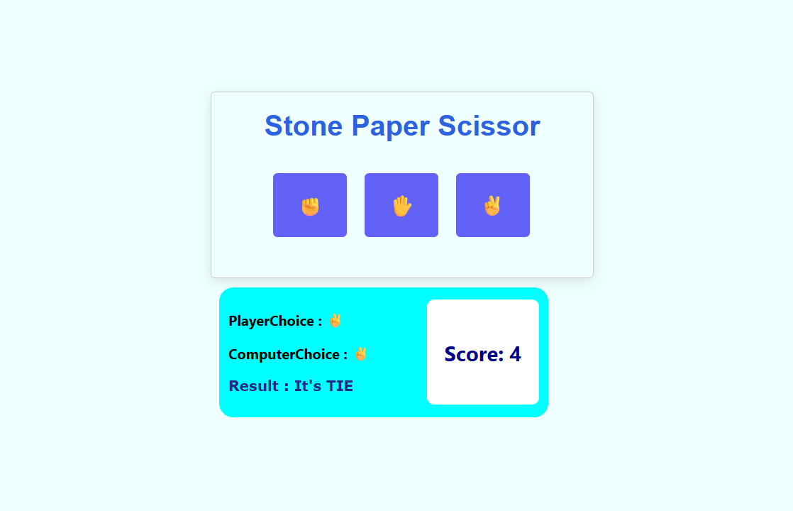

🪨📄✂️ Stone-Paper-Scissor

A simple Stone-Paper-Scissor game built with React ⚡.
Play against the computer, track your score, and enjoy a clean responsive UI.

🎮 Features

✊ ✋ ✌️ Player vs Computer gameplay

🏆 Score tracking (persists using localStorage)

🎨 Responsive design with CSS Grid + modern UI

🔄 Refresh-safe – your score won’t reset on reload

⚡ Built with React + Hooks

📷 Screenshot

(Add a screenshot of your app here — e.g., game screen with score)

 ](./screenshot.png)

🚀 Getting Started

Follow these steps to run the project locally:

1️⃣ Clone the repository
git clone https://github.com/your-username/Stone-Paper-Scissor.git
cd Stone-Paper-Scissor

2️⃣ Install dependencies
npm install

3️⃣ Start the development server
npm start

Your app will run at http://localhost:3000/
 🎉

🛠️ Tech Stack

React (useState, useEffect)

JavaScript (ES6+)

CSS3 (Grid, Flexbox, Transitions)

📂 Folder Structure
Stone-Paper-Scissor/
│── public/          # Static files
│── src/
│   ├── App.js       # Main game logic
│   ├── App.css      # Styles
│   └── index.js     # Entry point
│── package.json
│── README.md

